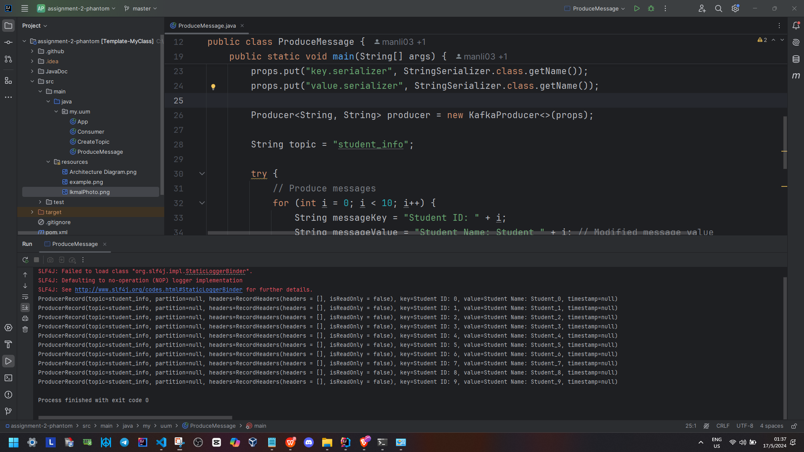
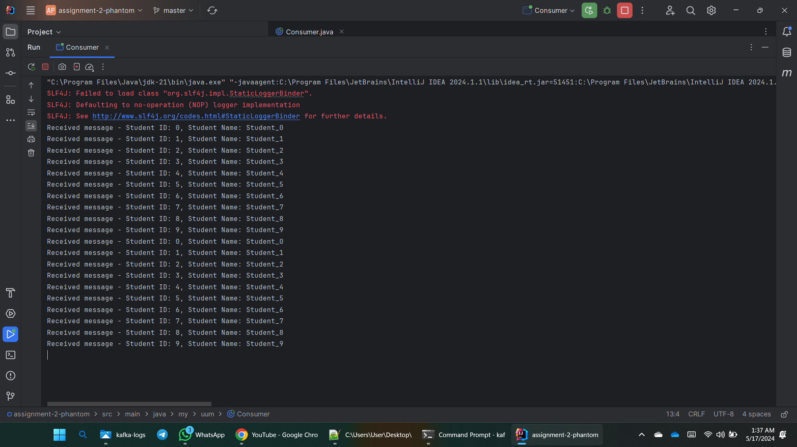

## Requirements for Assignment #2
[Read the instruction](https://github.com/STIW3054-A232/class-activity-stiw3054/blob/main/Assignment-2.md)

## Assessment Criteria
[Check the rubrics](https://github.com/STIW3054-A232/class-activity-stiw3054/blob/main/Rubrics-Assignment-2.md)

## Your Info:
1. Matric Number & Name & Photo & Phone Number
     - **Name:** Muhammad Aiman Bin Norazli
        - **Matric Number:** 294214
        - **Phone Number:** 017-4092591
        - **Photo:**  
        
     - **Name:** Ikmal Nazrin Bin Aziz
        - **Matric Number:** 294501
        - **Phone Number:** 011-69892748
        - **Photo:**  

 2. Other related info (if any)
   

## Title: Real-Time Messaging with Apache Kafka in KRaft Mode
## Abstract (in 300 words)

### Background
Apache Kafka is a widely used distributed streaming platform that facilitates high-throughput data pipelines and real-time data streaming applications. Traditionally, Kafka relies on Zookeeper for metadata management, but the recent introduction of KRaft mode (Kafka Raft Metadata mode) allows Kafka to manage its metadata independently, simplifying the architecture by eliminating the need for Zookeeper.

### Problem Statement
Configuring Apache Kafka in KRaft mode can be intricate, particularly for those new to distributed systems. This project addresses the challenge of setting up Apache Kafka in KRaft mode and developing Java applications for sending and receiving messages between two PCs. This setup aims to enhance understanding of real-time messaging and distributed system architecture.

### Main Objective
The primary objective of this project is to configure Apache Kafka in KRaft mode and create Java applications to facilitate real-time message exchange between two PCs. This involves setting up Kafka brokers on each PC, developing a producer to send messages containing `student_id` and `student_name`, and a consumer to receive and display these messages.

### Methodology
1. **Kafka Setup in KRaft Mode:**
   - Download and extract the latest Kafka version on both PCs.
   - Configure the `server.properties` file for KRaft mode by setting the cluster ID and removing Zookeeper settings.
   - Ensure necessary network ports are open for Kafka communication.
   - Start Kafka brokers on both PCs and verify network connectivity.

2. **Developing Producer and Consumer:**
   - On PC 1, create a Java project and implement a producer to send messages to the `student_info` topic.
   - On PC 2, create a Java project and implement a consumer to read messages from the `student_info` topic and display them.

### Result
The successful setup of Kafka in KRaft mode and the development of the producer and consumer applications demonstrated real-time message communication between the two PCs. The producer was able to send messages containing student information, which were accurately received and displayed by the consumer.

### Conclusion
This project effectively showcases the setup and use of Apache Kafka in KRaft mode for real-time messaging. By eliminating the need for Zookeeper, it simplifies the Kafka architecture and provides hands-on experience with distributed systems. The implementation highlights Kafka's capabilities and serves as a valuable educational resource for understanding real-time data streaming and messaging systems.

## Architecture Diagram

## References (Not less than 10)

- Aleksic, M. (2024, April 24). How to deploy Kafka on kubernetes. Knowledge Base by phoenixNAP. https://phoenixnap.com/kb/kafka-on-kubernetes

- Apache Kafka. (n.d.). Apache Kafka. https://kafka.apache.org/documentation/#kraft

- Apache Kafka. (n.d.). Apache Kafka. https://kafka.apache.org/downloads

- Apache Kafka. (n.d.). Apache Kafka. https://kafka.apache.org/quickstart

- August2022. (2022, September 3). Kafka Middleware Setup. Oracle Help Center. https://docs.oracle.com/en/industries/financial-services/banking-liquidity-management/14.6.1.0.0/kafcg/kafka-middleware-setup.html#GUID-38B91274-DE37-4E79-A17D-E81FAD1354A7

- Bhatnagar, A. (2018, March 31). Quick installation of multi-broker Apache Kafka Cluster. Medium. https://medium.com/@ab2abhinav/quick-installation-of-multi-broker-apache-kafka-cluster-f7cbacc609ee

- Create a Kafka multi-broker cluster. (2023, April 18). https://docs.bitnami.com/virtual-machine/infrastructure/kafka/administration/create-cluster/

- Garg, G. (2018, May 28). How to setup a Kafka Cluster. dzone.com. https://dzone.com/articles/how-to-setup-kafka-cluster

- Kifarunix. (2024, March 10). Setup a Three-Node Kafka KRAFT cluster for scalable data streaming - Kifarunix.com. kifarunix.com. https://kifarunix.com/setup-a-three-node-kafka-kraft-cluster/

- Mahapatra, A. (2023, November 17). Apache Kafka 101: How to set up Kafka on your local. Medium. https://anishmahapatra.medium.com/apache-kafka-102-how-to-set-up-kafka-on-your-local-68f432dfb1ab

- Mewada, S. (2023, June 13). Setting up a Kafka cluster - scaler topics. Scaler Topics. https://www.scaler.com/topics/kafka-tutorial/setting-up-a-kafka-cluster/

- Nelamali, N. (2024, March 27). How to Setup a Kafka Cluster (step-by-step). Spark by {Examples}. https://sparkbyexamples.com/kafka/apache-kafka-cluster-setup/

- Nguyen, C. (2022, December 23). Create a Kafka cluster for development with Docker Compose. SHIFT ASIA | Dev Blog. https://blog.shiftasia.com/create-a-kafka-cluster-for-development-with-docker-compose/

## Youtube Presentation
[Youtube Video Link](https://youtu.be/q4EQtkrwgB0)

## Result/Output (Screenshot of the output)
**Producer View**

****

**Message Received by Consumer**

